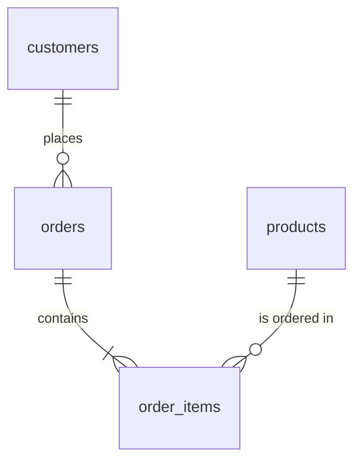
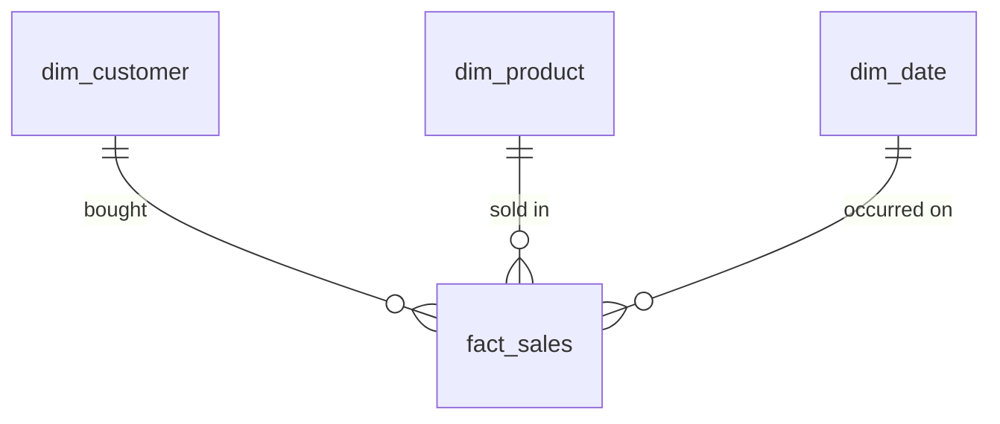

# Retail Lakehouse: Databricks Medallion Pipeline

> Production-grade ETL pipeline implementing bronze, silver, and gold medallion architecture on the Databricks Lakehouse, with analytics queries and commercial recommendations.

## Overview

This project ingests the built-in `/databricks-datasets/retail-org/` dataset (customers, sales orders, products) into a multi-layer Delta Lake architecture:

| Layer | Purpose | Tables |
|-------|---------|--------|
| **Bronze** | Raw ingestion, data stored as-is with metadata | `raw_customers`, `raw_sales_orders`, `raw_products` |
| **Silver** | Cleaned, typed, normalized (3NF) | `customers`, `orders`, `order_items`, `products` |
| **Gold** | Denormalized star schema for analytics | `dim_customer`, `dim_product`, `dim_date`, `fact_sales` |

```
Raw Files (CSV/JSON)
       │
       ▼
┌─────────────┐     ┌─────────────┐     ┌─────────────┐
│   BRONZE    │────▶│   SILVER    │────▶│    GOLD     │────▶ Dashboards
│  (raw land) │     │ (clean 3NF) │     │ (star dim)  │     & Decisions
└─────────────┘     └─────────────┘     └─────────────┘
```

## Project Structure

```
datapipeline/
├── README.md                          # Project overview and run instructions
├── requirements.txt                   # Pinned dependencies (DBR 14.3 LTS)
├── .gitignore                         # Excludes data/, secrets, caches
│
├── ingest/                            # Part A1: Bronze ingestion
│   ├── config.py                      # Centralized config and schemas
│   └── load_bronze.py                 # PySpark ingestion script
│
├── pipeline/                          # Parts A2-A4: Transforms
│   ├── 01_create_tables.sql           # DDL for all medallion layers
│   ├── 02_bronze_to_silver.py         # Cleaning and normalization
│   ├── 03_silver_to_gold.py           # Star schema denormalization
│   ├── data_model.md                  # ERD and 3NF rationale
│   └── utils/
│       ├── __init__.py
│       ├── transforms.py              # Reusable PySpark functions
│       └── quality.py                 # Data quality check helpers
│
├── sql/                               # Part A5: Analytics queries
│   └── analytics_queries.sql          # 6 gold-layer SQL queries
│
├── analysis_answers.md                # Part B: Insights and recommendation
├── write_up.md                        # Client-facing memo
│
└── tests/                             # Unit tests
    ├── test_transforms.py
    └── test_quality.py
```

## Quick Start

### Prerequisites

- **Databricks Runtime 14.3 LTS** (Spark 3.5.1, Delta Lake 3.2.0)
- The `/databricks-datasets/retail-org/` dataset (pre-loaded in every Databricks workspace)

### Option A: Run in Databricks Workspace

1. **Clone this repo** into your Databricks workspace via Git folders (Repos):
   ```
   Workspace > Repos > Add Repo > paste this GitHub URL
   ```

2. **Run the pipeline** in order:
   ```
   1. ingest/load_bronze.py            Loads raw data into bronze Delta tables
   2. pipeline/01_create_tables.sql     Creates schema structure (run in SQL editor)
   3. pipeline/02_bronze_to_silver.py   Cleans and normalizes into silver
   4. pipeline/03_silver_to_gold.py     Builds star schema in gold
   5. sql/analytics_queries.sql         Run queries against gold layer
   ```

3. **Cluster config**: any single-node or multi-node cluster on DBR 14.3 LTS. No additional libraries required.

### Option B: Run Locally (for development/testing)

```bash
# Create virtual environment
python -m venv .venv
source .venv/bin/activate  # or .venv\Scripts\activate on Windows

# Install dependencies
pip install -r requirements.txt

# Run tests
pytest tests/ -v
```

## Configuration

All configuration is centralized in [`ingest/config.py`](ingest/config.py):

| Variable | Default | Override |
|----------|---------|----------|
| `CATALOG` | `retail_lakehouse` | `CATALOG_NAME` env var |
| `BRONZE_SCHEMA` | `bronze` | N/A |
| `SILVER_SCHEMA` | `silver` | N/A |
| `GOLD_SCHEMA` | `gold` | N/A |

> **Note:** On Databricks Community Edition (which lacks Unity Catalog), set `CATALOG_NAME=hive_metastore` in cluster environment variables.

## Data Model

### Silver Layer: Normalized (3NF)



### Gold Layer: Star Schema



See [`pipeline/data_model.md`](pipeline/data_model.md) for the full ERD and normalization rationale.

## Testing

```bash
# Lint
ruff check ingest/ pipeline/ --ignore E501

# Format check
black --check ingest/ pipeline/ --line-length 120

# Unit tests
pytest tests/ -v
```

Tests cover:
- **Transform functions**: string standardization, deduplication, surrogate keys, null handling
- **Quality checks**: null rates, uniqueness, row counts, referential integrity

## Analytics Queries

Six production-ready queries in [`sql/analytics_queries.sql`](sql/analytics_queries.sql):

1. **Top 10 Customers**: by lifetime spend
2. **Monthly Revenue Trend**: with MoM % growth
3. **Outlier Detection**: z-score flagging on order totals
4. **Geographic Breakdown**: revenue by state
5. **Category Performance**: with discount impact analysis
6. **Loyalty Segment Analysis**: profitability and quarterly trends

## Commercial Analysis

See [`analysis_answers.md`](analysis_answers.md) for:
- 3 data-driven commercial insights
- Loyalty reactivation campaign recommendation
- Data quality strategy and production monitoring plan

See [`write_up.md`](write_up.md) for the non-technical stakeholder summary.

## Key Design Decisions

| Decision | Rationale |
|----------|-----------|
| **3NF in Silver, Star in Gold** | Silver serves as a single source of truth (correct, non-redundant). Gold provides fast analytics (pre-aggregated, minimal joins). |
| **Hash-based dedup in Silver** | `ROW_NUMBER()` window dedup on natural keys with latest-wins semantics. |
| **`monotonically_increasing_id()` surrogate keys in Gold** | Stable integer keys for efficient joins. Generated at write time for compatibility with overwrite mode. Natural keys preserved for traceability. |
| **Explicit schemas in Bronze** | Fail-fast on schema drift rather than silent inference errors. |
| **Modular transform functions** | Reusable, testable, composable. Each table transform is an isolated function. |

## Runtime Versions

| Component | Version |
|-----------|---------|
| Databricks Runtime | 14.3 LTS |
| Apache Spark | 3.5.1 |
| Delta Lake | 3.2.0 |
| Python | 3.11 |

---

*Built for the Elio Technical Assessment: Data & AI Engineer*
