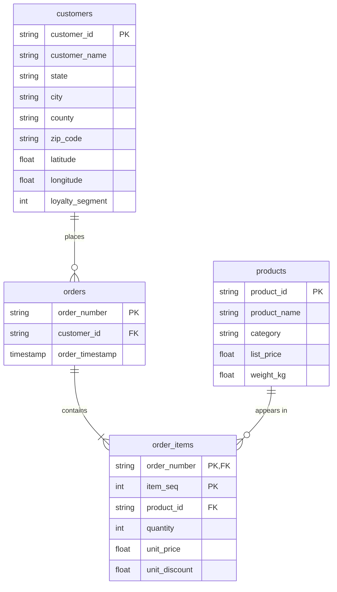
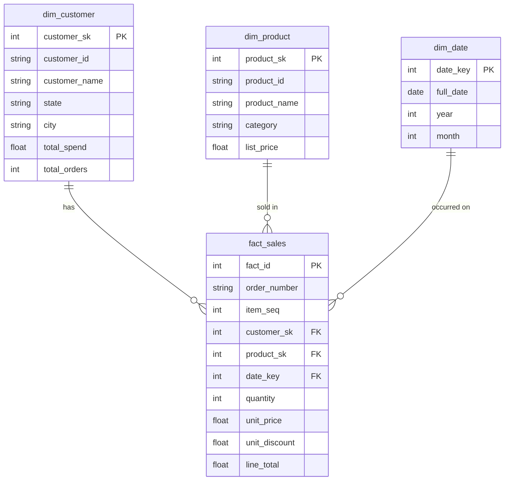

# Data Model Documentation

## Section 1: Entity-Relationship Diagram (Silver — 3NF)

## Section 2: Star Schema (Gold — Dimensional)

## Section 3: Normalisation Rationale

- **1NF:** All columns are atomic. The nested ordered_products array in the raw JSON is exploded into the separate order_items entity with one row per line item. No repeating groups.
- **2NF:** All non-key attributes depend on the full primary key. In order_items (composite PK: order_number + item_seq), product_id, quantity, unit_price etc. all depend on the specific line item within a specific order — not on order_number alone.
- **3NF:** No transitive dependencies. Customer city/state could depend on zip_code, but since US zip codes don't map 1:1 to cities (P.O. boxes, multi-city zips), we keep them as direct attributes. Product details (name, category, price) are stored in the products entity, not repeated in order_items.
- **Many-to-many resolution:** The orders↔products M:N relationship is resolved through the order_items bridge table.
- **Deliberate denormalisation in Gold:** The dim_customer table pre-aggregates lifetime metrics (total_orders, total_spend, avg_order_value) that would require joining orders + order_items for every query. This trades storage for query performance and analyst convenience.

## Section 4: Key Strategy

- **Bronze**: Original keys preserved as-is, `_raw_row_hash` added for dedup detection.
- **Silver**: Natural keys (`customer_id`, `order_number`, `product_id`) cleaned and validated.
- **Gold**: Surrogate keys (`customer_sk`, `product_sk`) generated via `monotonically_increasing_id()` on dimensions; `date_key` is an integer (yyyyMMdd format); fact table references surrogate keys.
